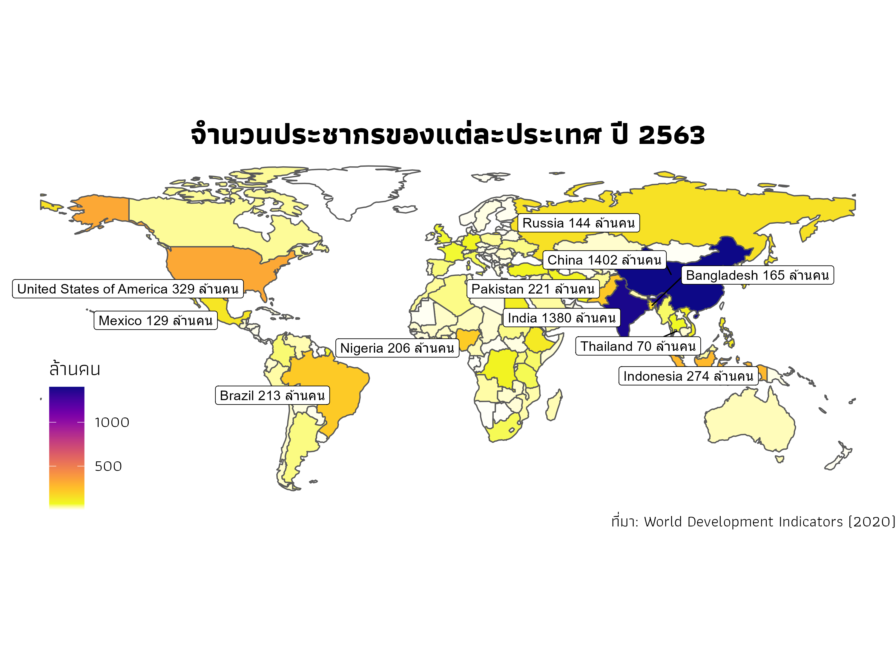

### คำอธิบาย
ในปี 2563 ประชากรโลกมีจำนวน **7,753 ล้านคน** โดยประเทศที่มีจำนวนประชากรมากที่สุด 10 อันดับ คือ
1. จีน 1,402 ล้านคน
2. อินเดีย 1,380 ล้านคน
3. สหรัฐอเมริกา 329 ล้านคน
4. อินโดนีเซีย 274 ล้านคน
5. ปากีสถาน 221 ล้านคน
6. บราซิล 213 ล้านคน
7. ไนจีเรีย 206 ล้านคน
8. บังคลาเทศ 165 ล้านคน
9. รัสเซีย 144 ล้านคน
10. เม็กซิโก 129 ล้านคน

โดย **ไทย** เป็นอันดับ **20** ของโลก มีประชากร 70 ล้านคน

### ขั้นตอนการทำกราฟแผนที่

- load package ที่ใช้
```{r}
library(WDI)
library(sf)
library(geojsonio)
library(tidyverse)
library(paletteer)
library(extrafont)
library(ggsflabel) # devtools::install_github("yutannihilation/ggsflabel")
```

- load font ภาษาไทย
```{r}
extrafont::loadfonts(device = "win", quiet = TRUE)
```

- download ข้อมูลจาก Worldbank ด้วย package `WDI`
```{r}
dat <- WDI(indicator='SP.POP.TOTL', start=1960, end=2020)
```

- แปลงข้อมูลให้พร้อมสำหรับทำ data visualization
```{r}
pop2020 <- dat %>% 
  filter(year == 2020) %>% 
  rename('population' = 'SP.POP.TOTL' ) %>%
  mutate(population = population/1e6)
```

- โหลดข้อมูลแผนที่โลก และเชื่อมข้อมูลประชากรกับข้อมูลแผนที่
```{r}
world <- read_sf("world.geojson")
world_pop <- world %>% left_join(pop2020, by = c("iso_a2" = "iso2c"))
```

- highlight 10 ประเทศที่มีประชากรมากที่สุดและไทย 
```
world_pop_top10 <- world_pop %>% top_n(10, population)
world_pop_th <- world_pop %>% filter(iso_a2 == 'TH')
```

- สร้าง label หรือ ป้ายกำกับอธิบายข้อมูล
```
world_pop_label <- rbind(world_pop_top10, world_pop_th) %>%
  mutate(label = glue::glue('{admin} {round(population, 0)} ล้านคน'))
```

- สร้างแผนที่
```{r}
ggplot(world_pop) +
  geom_sf(aes(fill = population)) +
  geom_sf_label_repel(
    data = world_pop_label, 
    aes(label = label), 
    force = 100, 
    nudge_x = -5, 
    seed = 10) +
  scale_fill_gradientn(
    colors = c("white", paletteer_c("viridis::plasma", 20, -1)),
    values = seq(0, 1, length.out = 6),
    na.value = "white"
  ) +
  labs(
    title = 'จำนวนประชากรของแต่ละประเทศ ปี 2563',
    caption = 'ที่มา: World Development Indicators (2020)',
    fill = 'ล้านคน'
  ) +
  theme_void(
    base_family = "Athiti",
    base_size = 16
  ) +
  theme(
    plot.title = element_text(hjust = 0.5, size = 24, face = "bold"),
    legend.position = c(0.1, 0.2),
    legend.key.width= unit(1, 'cm'),
    legend.key.height= unit(0.7, 'cm')
  )
```